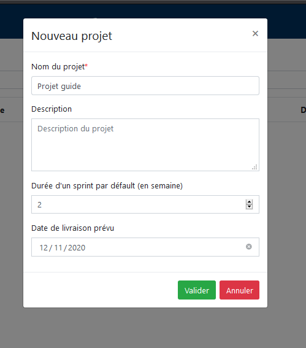
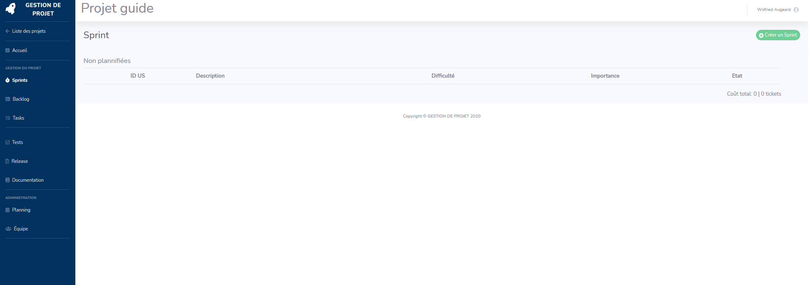
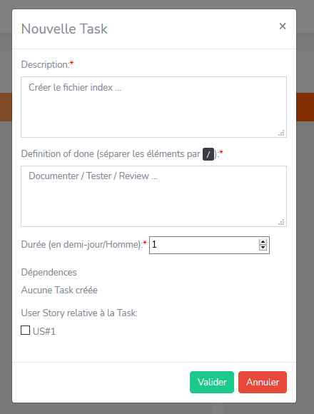

# Manuel d'utilisation
Correspond à la version v2.1.0 de l'application

Certaines fonctionnalités peuvent être différentes voir inexistantes dans les versions précédentes
## Accueil et création de projet

 
Voici la page d'accueil, elle listera tous les projets auquels vous participez. 
Depuis cette page vous pouvez créer un nouveau projet où vous serez le product owner en cliquant sur le bouton `+ Créer un projet`. Un pop-in s'ouvririra alors.

 
Depuis ce pop-in vous devez entrer les informations relative au projet que vous voulez créer. Les champs marqué d'un astérisque sont obligatoire. Ces informations seront modifiables par la suite. 
Après avoir valider la création du projet vous pourrez y acceder en cliquant dessus dans la liste

## Projet

 
Lorsque vous cliquez sur un projet vous arrivez sur la page d'accueil du projet, cette page vous permet de visualiser des informations à propos du projet tel que la vélocité ou l'avancement d'un sprint. 
Si vous avez les droits nécéssaire vous avez la possibilité de modifier les informations du projet en cliquant sur le bouton `Modifier le projet`. 
Sur la gauche vous avez le menu d'accès aux différents artefacts de la gestion de projet agile.

## Sprint

 
Voici la page de sprint obtenu en cliquant sur le bouton sprint du menu. Depuis cette page vous avez la possibilité de voir les différents sprints du projet ainsi que les US associés à ces Sprints. Pour créer un sprint cliquez sur le bouton `+ Créer un Sprint`

 
Depuis ce pop-in vous devez entrer les informations relatives au sprint. Cliquer sur le bouton valider le fera alors apparaitre dans la liste de Sprint

## Backlog et User Story

 
Voici la page backlog obtenu en cliquant sur le bouton backlog du menu. Depuis cette page vous avez la possibilité de voir les différentes US du projet a. Pour créer une cliquez sur le bouton `+ Créer une User Story`

 
Depuis ce pop-in vous devez entrer les informations relatives à l'US, la redaction suit un template pré-défini imposé (en tant que <...> je souhaite <...> afin de <...>). L'importance à une échelle paire pour éviter de tout avoir en priorité "moyenne". La plannification correspond au sprint où cette US sera réalisé, si aucun sprint n'est crée il est impossible de planifier l'US. Ces informations seront modifiables par la suite. Valider fera apparaître l'US dans la liste de US

 
Maintenant qu'il y a des US dans le projet vous pouvez les trier par ID, Difficulté, Importance, Planification ou Etat en cliquant sur la colonne correspondante (cliquer une fois fera un tri croissant, cliquer une deuxième fois fera un tri décroissant), de base les US sont triées par ID. 
Vous pouvez également modifier une US en cliquant sur le bouton `crayon orange` ou la supprimer en cliquant sur le bouton `poubelle rouge`. **La suppression n'est possible que si l'US n'est dans aucun sprint**

## Task et kanban
 
Voici la page backlog obtenu en cliquant sur le bouton task du menu. Elle prend la forme d'un kanban. Depuis cette page vous avez la possibilité de voir les différentes task du projet ainsi que leur état. Pour créer une task cliquez sur le bouton `+ Créer une Task`

 
Depuis ce pop-in vous devez rentrer les informations relative à la task, séparer les informations du DOD par un **/** sont important car cela prendra la forme d'une check list. Si plusieurs tasks sont déjà créées il est possible de créer une dépendance pour indiquer que cette task requier la complétion d'autres tasks. Il est également possible de lier la task à une US. Ces informations seront modifiables par la suite.

 
Une fois la task créée elle est dans la colone todo du kanban, vous pouvez la déplacer à l'aide d'un cliquer-glisser-déposer. Il est possible de cliquer sur le bouton `crayon orange` pour la modifier.

 
Cliquer sur une task affichera ses informations, depuis ce pop-in il est possible de cocher les cases du DOD afin de savoir ce qui est bon. Il est également possible de supprimer la task **Uniquement si elle est dans la colone TODO**

## Release
 
Voici la page backlog obtenu en cliquant sur le bouton release du menu. Depuis cette page vous avez la possibilité de voir les différentes release du projet. Pour créer une release cliquez sur le bouton `+ Upload a release`

 
Depuis ce pop-in vous devez renseigner les informations à propos de la release ainsi qu'ajouter une archive de cette release  **/!\\ Une fois une release créée il n'est pas possible de la modifier ni de la suprimmer /!\\**

Une fois une release créée elle apparaît dans la liste des release il est possible de télécharger l'archive en cliquant sur bouton `Flèche verte`.